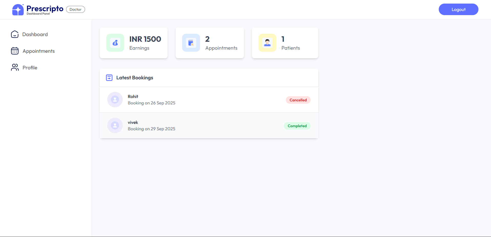
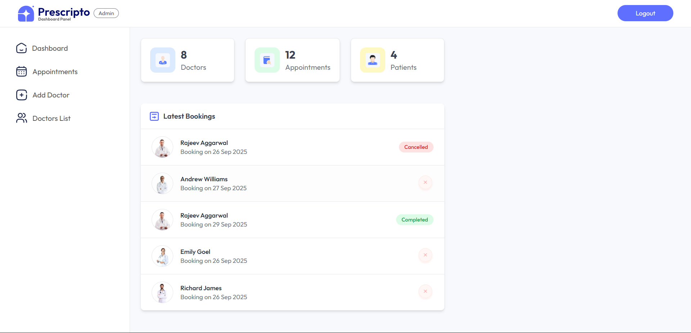

  
# PRESCRIPTO 👨‍⚕️🏥🤒

This full stack appointment booking system can be used by a doctor or a hospital. Because in this project I have created 3 level of authentication. 1st one is for Patients, so that patient can login on the website, book appointment with doctor and manage the booked appointment. 2nd one is doctor login, so that doctor can login and check the appointment and their earning. Doctor can update their profile also from dashboard. 3rd one is Admin Dashboard where admin can manages the appointment and admin can also manage the doctor profile.

 
 

## LIVE - DEMO 🌐
  
**UI** 👉 [LINK](https://prescripto-patient-portal.vercel.app)

**Admin Dashboard** 👉 [LINK](https://prescripto-admin-portal.vercel.app)

 
 

# User Dashboard 👤:

 
 

# Doctor Panel 🧑‍⚕️:

 
 

# Admin Panel 🎯:

 
 

## Author :black_nib:
- _[Github](https://github.com/vivekgoyal-1) | [Linkedin](https://www.linkedin.com/in/vivek-goyal-080440262/)_

Enjoy the care by VIVEK! 🎉

  